# Computing a matrix inverse with thermal noise

*A two-node analog computer on a breadboard: two dual op-amps and some passives. It inverts a 2×2
matrix by sitting still and being noisy.*

Drive each node of a resistor–capacitor network with independent thermal noise, and the covariance
of the node voltages is the inverse of the network's conductance matrix. That is the proposal behind
thermodynamic linear algebra. Its runtime, error falling as 1/√T, covers statistical error only.
Real hardware also has a systematic floor, and whether the idea scales depends on whether that floor
grows with the condition number κ. This board tests the identity and that scaling.

**Shown, on this board:**

- `Σ = c·G⁻¹` holds to about 1 percentage point, the uncertainty set by interference lines.
- The process is at equilibrium: reversible within the ±6 mrad phase resolution over
  200 Hz – 5 kHz (excluding the 800–1600 Hz probe-pickup band), and Gaussian to ~1 %. Three of four ladder rungs pass; κ = 21
  fails.
- A systematic floor exists that the runtime theory omits. One grounding change moved it 3.3 pp.
- The floor does not grow like κ. At κ = 10.4 a κ¹ floor is ruled out at 6.3σ however much probe
  pickup is assumed; at κ = 21, at 16.6σ with no pickup correction. The largest deviation is at the
  *lowest* κ and is unexplained.

**Not shown:** anything beyond κ = 21, matrices larger than 2 × 2, or any other device; whether the
floor grows more slowly than κ (√κ is not ruled out). The floor's value is specific to this board
and its leads.

---

## The circuit

### The network is the matrix

A resistor's Johnson–Nyquist noise has power spectral density `4k_BTR`. Drive each node of an RC
network with its own independent noise source, and the node voltages' covariance is the inverse
of the conductance matrix, up to a scale factor:

> **Σ = c · G⁻¹**

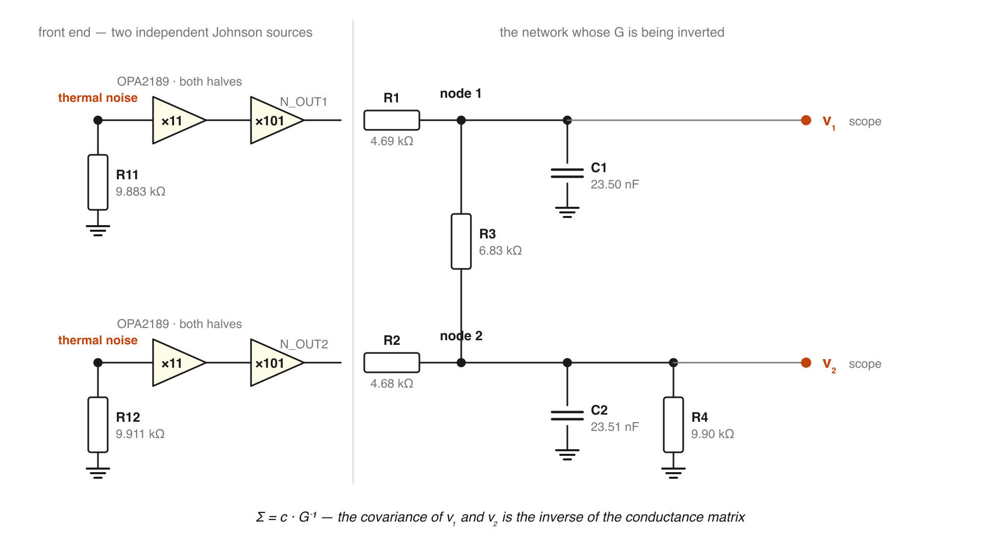

R1 and R2 connect each node to its drive, R3 couples the nodes, R4 takes node 2 to ground:

```
G = | 1/R1 + 1/R3        −1/R3          |          C = diag(C1, C2)
    |    −1/R3      1/R2 + 1/R3 + 1/R4  |
```

Readout is the covariance of the recorded node voltages. On this board its statistical error
reaches 10 % in about 20 ms and 1 % in about 2 s.

Getting the inverse from the covariance is the proposal of
[Aifer et al. (2023)](https://arxiv.org/abs/2308.05660). Normal Computing built an eight-cell
version from RLC cells coupled through switched capacitances
([Melanson et al., 2025](https://www.nature.com/articles/s41467-025-59011-x)). This board is a
two-cell RC relative, with a fixed resistor for the coupling.

### Drive

Each node is driven by the Johnson noise of its own 10 kΩ resistor through its own two-stage
zero-drift amplifier, so the drives are independent by construction.

The scale factor is per node, `c_i = S_i/(4C_i)`, with `S_i` the one-sided density of the current
the drive injects (`S_V/R1²` for a voltage density `S_V` through R1). `Σ = c·G⁻¹` needs `c₁ = c₂`:
equal drives into equal capacitors.

### What the theory predicts

The network has two relaxation times, τ_slow and τ_fast, the reciprocals of the eigenvalues of
`C⁻¹G`. Aifer et al. give a runtime `ε = √(2τ_slow/T)`, with T the integration time, and from it
argue for a speedup over digital solvers that grows with matrix dimension.

That covers statistical error only. Component tolerance, unequal drive, stray reactance and the
readout add a bias that integration does not remove, and to first order a bias in `G` is amplified
by up to κ, the ratio of `G`'s largest to smallest eigenvalue:

```
δ(G⁻¹) = −G⁻¹ δG G⁻¹        ⟹        ‖δ(G⁻¹)‖ / ‖G⁻¹‖  ≤  κ · ‖δG‖ / ‖G‖
```

### Raising κ: the ladder

Shrinking R3 makes the matrix nominally harder without making it harder to sample: 100× smaller
raises κ fiftyfold but moves τ_slow only 3 %. The ladder instead raises κ by raising the leak
resistance, which slows τ_slow with it. It is symmetric: R4 removed, R3 = 1 k, and
R1 ≈ R2 = RL at 1 k, 2.2 k, 4.7 k and 10 k, giving κ = 1 + 2RL/R3 = 3.0, 5.3, 10.4 and 21.0. Each
rung was recorded like the main network: thirty 0.6 s records.

ρ₁₂ is a poor observable here, since it saturates at (κ−1)/(κ+1). In a symmetric network the common
and differential modes are the eigenvectors, so `κ_meas = var(v₁+v₂)/var(v₁−v₂)` measures κ
directly. Three hypotheses for how the floor scales with κ were registered in
[`error_model.py`](error_model.py) before the first rung was built.

---

## The breadboard

### Build and measured values

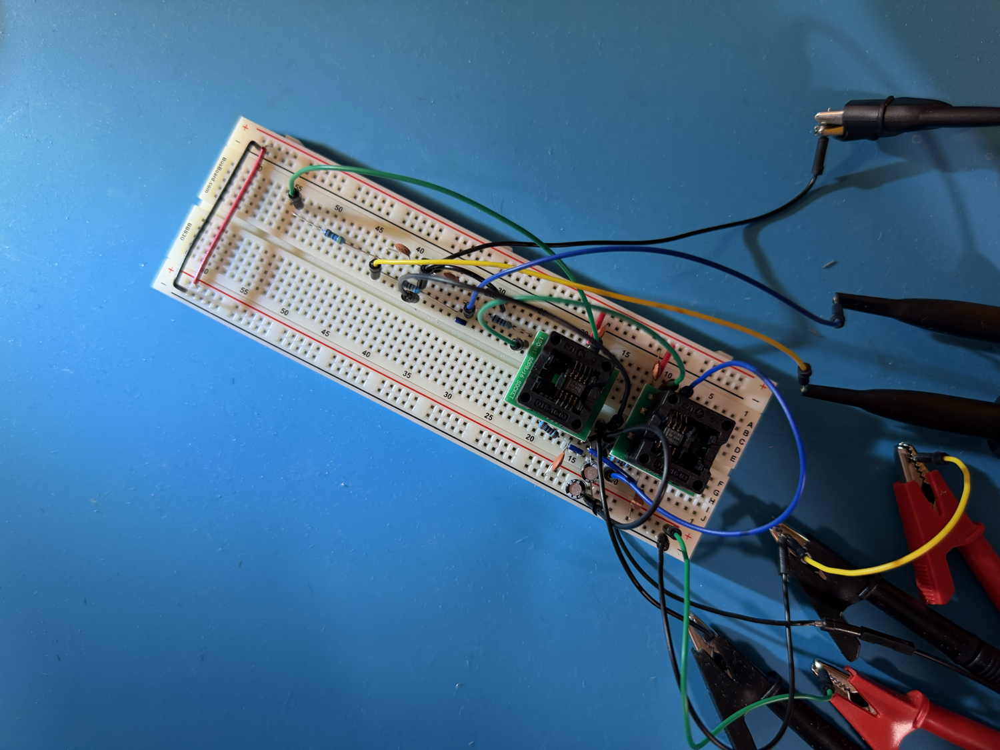

Two dual op-amps, fourteen resistors, capacitors, ±12 V. Every wire is in
[`WIRING_LIST.md`](WIRING_LIST.md).

| part | role | nominal | measured | deviation |
|---|---|---|---|---|
| R1 | source resistor into node 1 | 4.7 kΩ | 4.690 kΩ | −0.2 % |
| R2 | source resistor into node 2 | 4.7 kΩ | 4.680 kΩ | −0.4 % |
| R3 | coupling resistor | 6.8 kΩ | 6.830 kΩ | +0.4 % |
| R4 | node 2 to ground | 10 kΩ | 9.900 kΩ | −1.0 % |
| C1 | node 1 to ground | 22 nF | **23.50 nF** | +6.8 % |
| C2 | node 2 to ground | 22 nF | **23.51 nF** | +6.9 % |
| R11 | Johnson source, channel A | 10 kΩ | 9.883 kΩ | −1.2 % |
| R12 | Johnson source, channel B | 10 kΩ | 9.911 kΩ | −0.9 % |

All values are out-of-circuit multimeter readings, including the eight gain-setting resistors, so
the gains (1125 and 1130) are computed. **The model** throughout is built from these readings with
no fitted parameters.

The capacitors are matched to 0.04 % from a batch of nine. The first C1 was 26.8 nF, 14 % from C2,
which moved the predicted `Σ·G` off-diagonal from −0.41 % to +1.57 %.

### The drive is thermal

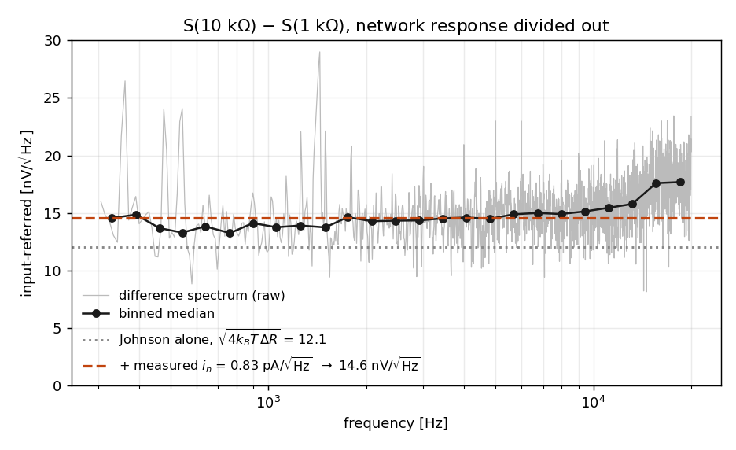

Subtracting spectra taken with a 10 kΩ and a 1 kΩ source leaves only terms that scale with R:
`4k_BT·ΔR` plus the amplifier's current noise, `i_n·√(R₁₀ₖ² − R₁ₖ²)`. Over 300 Hz – 20 kHz the
points scatter 7.3 % rms and rise about 20 % across the band (log-log slope +0.044).

| | predicted height |
|---|---|
| Johnson alone | 12.07 nV/√Hz |
| + datasheet current noise (165 fA) | 12.18 |
| + measured current noise (0.83 pA) | **14.57** |
| **measured** | **14.53** |

Solving for `i_n` gives 0.822 pA/√Hz, matching an independent capture (0.83) and five times the
datasheet value. This pair predates the matched capacitors and the cage. Neither matters: the
subtraction cancels pickup, and the network response is divided out with the capacitor then fitted.

### Interference and pickup

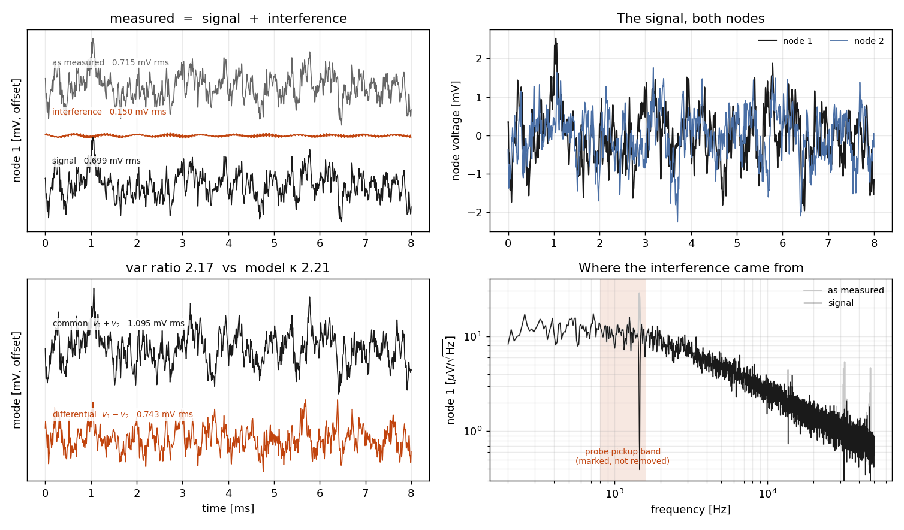

**Interference lines.** 27 bins (0.52 % of the band) exceed 3× their local median on the pooled
spectrum. They carry 4.9 % of node 1's power and 1.9 % of node 2's; the tallest is near 1.45 kHz;
the source is unidentified. They must be found on the averaged spectrum: in a single record, 12 %
of bins pass the threshold by chance.

**Probe-lead pickup**, measured with both probe tips on one point of the shield, puts 88.5 % of its
power in 800–1600 Hz. Added to the model it predicts +9 % on ρ₁₂ where +1.8 % is seen; if all of
the +1.8 % is pickup (an assumption), about a fifth reaches the nodes.

Both stay in every covariance (cutting 800–1600 Hz would remove 17.6 % of node 1's power, mostly
signal). The band is excluded only for the equilibrium phase test.

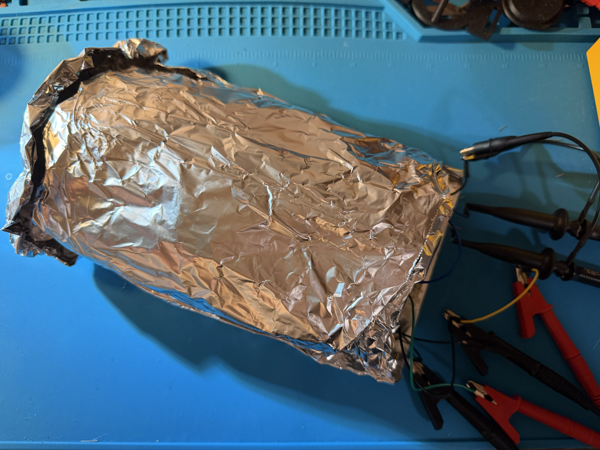

### Bench notes

- **Tie probe grounds to the shield, not the board's star ground.** Otherwise the leads form a
  common-mode path that biases ρ₁₂ by several percent.
- **Use a grounded enclosure.** Rotating the board 90° cut pickup ~10×; a foil cage wired to
  supply common cut it ~47×. An ungrounded cage couples noise in.
- **Don't re-dress leads between measurements you compare.** Tidier leads can carry less pickup
  but more coherent pickup, and make ρ₁₂ worse.
- **Check the star-ground tie's resistance.** A kilohm-scale tie is a shared return for both
  channels and reads as correlation.
- **Add gain after the network.** Stray capacitance from the last stage back to the 10 kΩ source
  closes a loop: at 61 dB it needs ~165 fF to oscillate, at 80 dB only 18 fF. Adjacent
  breadboard rows are picofarads.
- **Let it settle** 10–15 minutes after any change. Drift does not always cancel: the κ = 5.3 rung,
  started early, moved −2.3 % in κ_meas.
- **Don't trust the scope's RMS for noise.** Beyond ~1200 display columns the DS1000Z measures a
  min/max envelope, inflating noise RMS 4.4× at 6 Mpt. Accept a record only if the same envelope
  computed from the pulled samples reproduces the scope's number.
- **Avoid slow timebases.** At 500 ms/div the scope decimates without an anti-alias filter,
  folding content above 500 kHz into the band and tripling ρ₁₂. Capture fast and pool.

---

## Results

### It inverts the matrix

Thirty 0.6 s records, pooled, 200 Hz – 50 kHz. Off-diagonal rows are normalized by their diagonals;
their deviations are in percentage points.

| quantity | measured | model | deviation |
|---|---|---|---|
| **Σ·G off-diagonal** (zero if `Σ = c·G⁻¹`) | **−0.07 ± 0.25 %** | −0.41 % | +0.34 pp (1.4σ) |
| **Lyapunov off-diagonal** (zero for any diagonal drive) | **0.00 ± 0.22 %** | −0.69 % | +0.69 pp (3.2σ) |
| **ρ₁₂**, correlation between the nodes | **+0.3596 ± 0.0019** | +0.3532 | +1.8 % |
| **v₁/v₂**, amplitude ratio | **1.1340 ± 0.0024** | 1.1223 | +1.0 % |
| v₁, node 1 RMS | 0.7097 ± 0.0011 mV | 0.6057 mV | +17.2 % |
| v₂, node 2 RMS | 0.6258 ± 0.0009 mV | 0.5397 mV | +16.0 % |

- **Σ·G off-diagonal** agrees with the model within 1.4σ, but that error bar is statistical only:
  excising the interference lines moves it 1.1 pp, so the test passes at ~1 pp. The model is
  nonzero because band-limiting contributes −0.70 pp and the 1.6 % drive asymmetry +0.29 pp.
- **Lyapunov off-diagonal** tests `GΣC + CΣG = 2·diag(c_i C_i)`, which holds for any diagonal
  drive, so it does not assume `c₁ = c₂`. It misses its model by 3.2σ; omitted amplifier poles
  explain a fifth of the gap.
- **ρ₁₂** is 1.8 % high at 3.4σ: a systematic bias, from hardware or model. The probe leads are the
  likeliest source, not a proven one.
- **Node voltages** are 16–17 % high ([Limitations](#limitations)). The excess is nearly common
  to both nodes and cancels from ρ₁₂; their 1.2-point difference appears as the ratio row's
  +1.0 %.

The nodes' correlation is the answer, not contamination: Σ₁₂ carries `G⁻¹`'s off-diagonal. The
common and differential modes follow τ_slow = 92.0 µs and τ_fast = 41.6 µs. Their variance ratio
(2.17) only approximates κ = 2.21 here, because R4 makes the network asymmetric (full-band model
ratio 2.11); on the symmetric ladder it is exact.

Data: [`data/results-summary.csv`](data/results-summary.csv).

#### Spectra and correlation by band

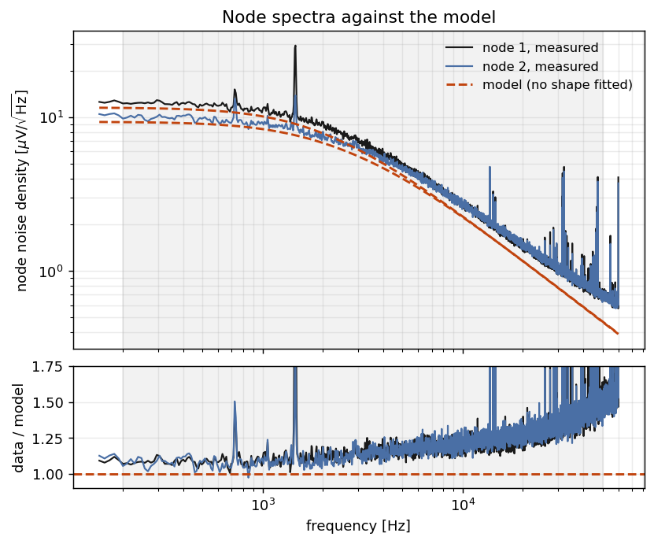

The model reproduces the roll-off and node separation but sits below the data by a factor that
grows with frequency: ×1.08 at 200–500 Hz to ×1.42 at 30–50 kHz (power-weighted, ×1.171 on node 1
and ×1.157 on node 2). Noise entering at the amplifier input would give a constant factor, so something is
added after the network, at the probe or scope.

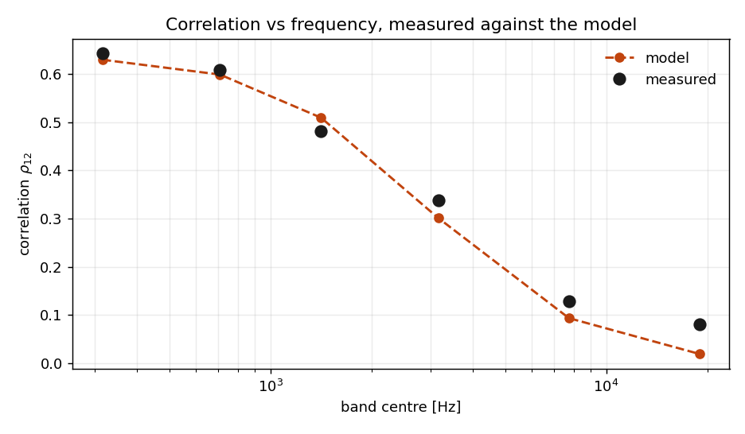

| band | measured | model | deviation |
|---|---|---|---|
| 200 – 500 Hz | 0.6424 | 0.6297 | +2.0 % |
| 500 Hz – 1 kHz | 0.6081 | 0.5989 | +1.5 % |
| 1 – 2 kHz | 0.4808 | 0.5095 | −5.6 % |
| 2 – 5 kHz | 0.3375 | 0.3011 | +12 % |
| 5 – 12 kHz | 0.1277 | 0.0934 | +37 % |
| 12 – 30 kHz | 0.0801 | 0.0190 | **+322 %** |

Above 5 kHz the measured ρ₁₂ falls much more slowly than the model: 0.08 against 0.019 at
12–30 kHz. The signal is weakest there, so the same post-network term dominates.

### It is at equilibrium

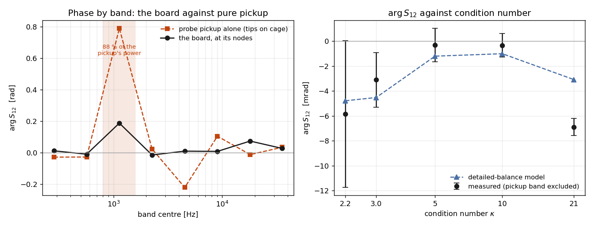

The covariance and spectra are unchanged under time reversal, so they cannot distinguish
equilibrium from a process that circulates probability. The drive is amplified to a
Johnson-equivalent temperature near 10⁹ K, so reversibility is worth measuring.

For `C ẋ = −Gx + ξ`, detailed balance requires `AΣ = ΣAᵀ` with `A = C⁻¹G`. With diagonal `C` and
drive this reduces to `c₁ = c₂`, the same condition as `Σ = c·G⁻¹`, so it is an independent test.
A reversible process has a real cross-spectrum; nonzero `Im[S₁₂]` is a probability current.

Phase of the cross-spectrum by band, with σ = √((1−γ²)/(2NKγ²)) from the coherence γ over
N = 1320 segments and K bins, and the pickup capture alongside:

| band | board phase, rad | vs its own σ | pickup phase, rad | share of pickup power |
|---|---|---|---|---|
| 200 – 400 Hz | +0.011 | 1.1σ | −0.029 | 0.5 % |
| 400 – 800 Hz | −0.011 | 1.4σ | −0.028 | 3 % |
| **800 – 1600 Hz** | **+0.187** | **27σ** | **+0.790** | **88.5 %** |
| 1600 – 3200 Hz | −0.015 | 2.4σ | +0.023 | 1 % |
| 3200 – 6400 Hz | +0.009 | 1.0σ | −0.222 | 0.6 % |
| 6400 – 12.8 kHz | +0.008 | 0.5σ | +0.104 | 1.4 % |
| **12.8 – 25.6 kHz** | **+0.073** | **5.6σ** | −0.013 | 1.4 % |
| **25.6 – 50 kHz** | **+0.026** | **6.0σ** | +0.034 | 3.4 % |

Three bands fail. 800–1600 Hz is the probe pickup. The two above 12.8 kHz coincide with the
post-network term seen in the spectra.

Over 200 Hz – 5 kHz without the pickup band, the phase is **−5.85 ± 5.90 mrad** against a model of
**−4.78** (0.2σ); the model is nonzero because `c₁/c₂ = 0.984`. With the band included it is
+53.8 mrad (9.9σ). Subtracting up to 1.4× the measured pickup moves the notched value under
1 mrad. Three of the four ladder rungs also pass; κ = 21 does not.

As a null check, pairing each record's node 1 with the previous record's node 2 drops the coherence
from 0.219 to 0.00001.

In band the signal is Gaussian: skewness and excess kurtosis are within 0.014 of zero, and the two
Gaussian fourth-moment identities, `⟨x₁²x₂²⟩ = ⟨x₁²⟩⟨x₂²⟩ + 2⟨x₁x₂⟩²` and
`⟨x₁³x₂⟩ = 3⟨x₁²⟩⟨x₁x₂⟩`, hold to +0.0013 ± 0.0030 and +0.0067 ± 0.0048. Above 50 kHz, where three
quarters of the raw power sits, excess kurtosis is +1.5 and +3.4. The network's corners are at a
few kilohertz, so that power is most likely the readout; band-limiting removes it.

Data: [`data/reversibility.csv`](data/reversibility.csv), [`data/moments.csv`](data/moments.csv).
Pre-registration, notch policy and estimator validation: [`equilibrium.py`](equilibrium.py).

### Precision improves as √T

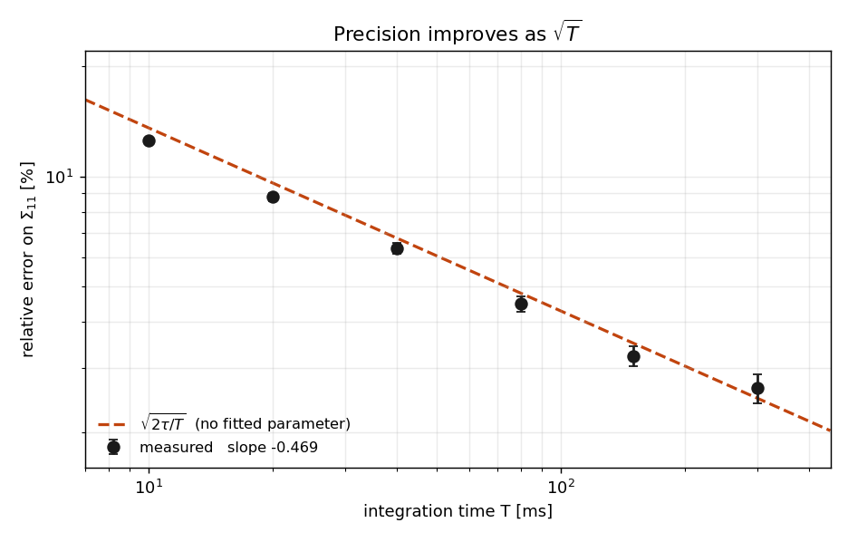

The error is the relative scatter of Σ₁₁ across windows of length T. The line is `√(2τ_slow/T)`
with τ_slow = 92.0 µs from the measured components; nothing is fitted. The measured slope is
−0.469 ± 0.016, within 2σ of −0.5.

Five of six points sit 6–9 % below the line, as expected: Σ₁₁ mixes both modes, so its effective
τ lies between τ_fast (41.6 µs) and τ_slow. A fit gives 79 µs. The 300 ms point (60 windows) sits
7 % above. The law holds from 10 to 300 ms.

Data: [`data/precision-vs-time.csv`](data/precision-vs-time.csv).

### There is a floor

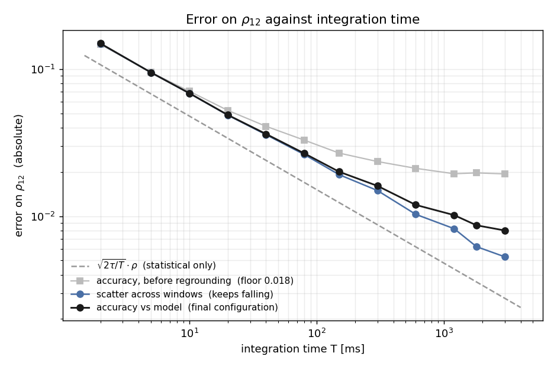

For each window length T, ρ₁₂ is estimated on every window. The scatter across windows falls as
1/√T regardless of bias; the RMS deviation from the model is √(scatter² + bias²) and flattens at the
bias. Records are pooled for T > 0.6 s (each record is ~6500 τ_slow).

With probe grounds on the shield, the bias is 0.0064 (1.8 % of ρ₁₂, 3.4σ). At the longest window,
3 s (six windows), the accuracy is 0.0080 against a scatter of 0.0053: the curves have separated
but not yet flattened.

With probe grounds on the star ground instead (gray), the bias was 5.1 % and flat from 0.3 to
3 s, while the amplitude ratio stayed within 0.4 %: the signature of a common-mode
path. The runtime formula has no term for this floor, and the build sets at least part of it.

Data: [`data/systematic-floor.csv`](data/systematic-floor.csv).

### The floor does not grow like κ

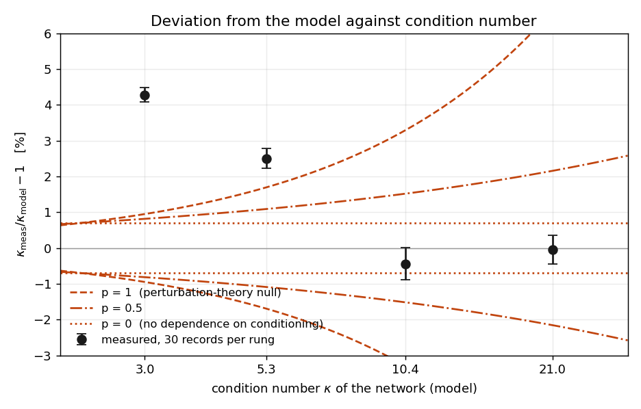

The registered hypotheses are `|error| = 0.7 % × (κ/2.21)^p` for p = 1, 0.5 and 0. The 0.7 % is an
upper bound, not a measurement: the ρ₁₂ bias after subtracting modeled pickup. All exclusions below
are relative to it.

κ_meas runs 1.14–1.37× the eigenvalue ratio because of band-limiting and amplifier poles (23.97 at
κ = 21). The model is computed the same way, so this cancels.

| κ | κ_meas vs model | p = 1 | p = 0.5 | p = 0 |
|---|---|---|---|---|
| 3.0 | **+4.27 ± 0.20 %** | 0.95 % | 0.81 % | 0.70 % |
| 5.3 | +2.50 ± 0.28 % | 1.69 % | 1.09 % | 0.70 % |
| 10.4 | −0.44 ± 0.46 % | 3.29 % | 1.52 % | 0.70 % |
| 21.0 | **−0.05 ± 0.40 %** | **6.64 %** | 2.16 % | 0.70 % |

- **κ = 10.4** rules out p = 1 at 6.3σ. Adding back any fraction of its small pickup keeps the
  deviation between −0.44 % and +0.31 %, and the exclusion between 6.3σ and 7.1σ.
- **κ = 21** rules out p = 1 at 16.6σ without pickup, but pickup is 14 % of its differential mode
  (0.3 % at κ = 3). Adding back one fifth gives +1.8 %, consistent with p = 0.5 (1.0σ); about three
  quarters would match p = 1; all of it gives +8.44 %.
- **κ = 3** exceeds every prediction by 16σ, stable across all records. Unexplained.
- **κ = 5.3** started before the board settled and drifted −2.3 %; settled, it reads about +1.5 %.

The ladder shows an unexplained excess at κ = 3, not a floor that grows with κ. p = 0.5 remains
open.

Data: [`data/ladder-rungs.csv`](data/ladder-rungs.csv). Model: [`kappa_ladder.py`](kappa_ladder.py).
Pickup sweep: [`pickup_sensitivity.py`](pickup_sensitivity.py).

---

## Conclusions and next steps

### What it means for NGD

This section simulates the registered error model. With the floor, the runtime becomes

```
T(ε, κ) = 2 κ τ_fast / (ε² − ε_sys²)        ε_sys = 0.7 % × (κ/2.21)^p
```

(`κ·τ_fast = τ_slow`). T diverges when ε_sys reaches the target, so a 1 % answer is out of reach past
κ ≈ 3.2 under p = 1 and κ ≈ 4.5 under p = 0.5. Under p = 0 there is no limit.

Natural gradient descent solves `(F + λI)d = g` each step, with `F` the Fisher matrix. `F` is
singular for softmax networks (shifting all logits changes nothing), so the damping λ caps κ_eff,
the condition number of `F + λI`, at about λ_max/λ. For a 730-parameter MNIST network, each step
was solved exactly, with a flat 0.7 % floor (p = 0), and with the p = 1 floor, sweeping κ_eff from 8
to 7 × 10⁴.

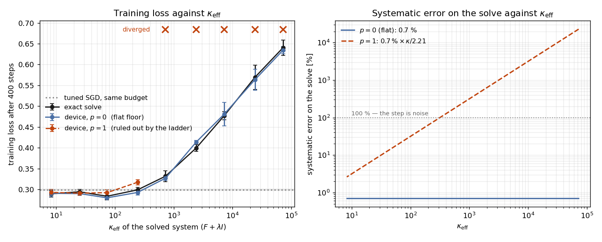

- **Flat floor:** training loss matches the exact solve at every damping (eight of nine points
  within 1.2σ, one at 2.7σ; σ = standard error over three seeds).
- **p = 1 floor:** diverges above κ_eff ≈ 700, and elsewhere keeps half of NGD's advantage over
  tuned SGD (5 % lower training loss).
- **Time:** at the best damping, reaching the flat floor takes 3.0 × 10⁶ fast relaxation times per
  solve: 33 s at the κ = 21 rung's τ_fast (11 µs), 3 ms at τ = 1 ns.

One small network, assuming the 2 × 2 error model holds at 730 × 730; p = 0.5 is bracketed, not
simulated.

Data: [`data/ngd-damping.csv`](data/ngd-damping.csv). Code: [`ngd_sim.py`](ngd_sim.py).

### Limitations

- **Band-limited.** `Σ = c·G⁻¹` is a full-band identity; data and model are both integrated over
  200 Hz – 50 kHz (30 kHz for the ladder).
- **Amplifier poles omitted from the main model.** Including them moves the predicted off-diagonals
  to −0.27 % and −0.55 %, closing 41 % and 20 % of the gaps. The published model is left unchanged.
- **The 16–17 % amplitude excess is explained in size but not shape.** The budget predicts
  14.38 nV/√Hz input-referred (12.73 thermal, 5.20 op-amp voltage noise, 3.86 feedback network,
  1.63 current noise). With measured op-amp noise (0.83 pA/√Hz, ≈9 nV/√Hz) it gives 18.06 against
  the 18.15 observed. But input-referred noise gives a flat data-to-model ratio, and the measured one
  rises ×1.08 → ×1.42. Probe pickup (10 % and 4 % of signal power) cannot produce that either.
- **The spectra cannot measure C.** A fitted capacitance absorbs the excess and breaks the κ = 21
  rung. The multimeter values are used, and κ_meas agrees with them.
- **Interference lines limit the identity test to ~1 pp.** Excising them shifts the Σ·G
  off-diagonal +1.14 pp, the Lyapunov off-diagonal +0.45 pp, v₁/v₂ −1.5 % and ρ₁₂ +0.9 %. On the
  ladder only κ = 21 has lines, shifting κ_meas +0.64 %.
- **Floor and model error are not separable** at the percent level without a swept-sine transfer
  function.
- **The 0.7 % coefficient is circular.** The one-fifth pickup coupling assumes the whole +1.8 % is
  pickup, so subtracting it leaves ~0 by construction; the 0.7 % is what the ±40 % uncertainty on
  that coupling allows. It was set on ρ₁₂ and applied to κ_meas. A p = 1 law starting from 0.04 %
  would survive the ladder. What holds regardless is that κ = 10.4 is within ±1 % of the model.
- **The κ = 3 excess is unexplained.** Resistor mismatch (0.12 %), warm-up, pickup, amplifier
  bandwidth and uniform capacitance error were checked. The resistor check and the rung's stability
  are logged in [`error_model.py`](error_model.py).
- **The κ = 21 rung is the weakest:** smallest differential mode, most pickup, +1.7 % drift over
  its run (last ten records: +0.52 %, still 15.3σ from p = 1 without pickup), and it fails the
  equilibrium test (−6.90 ± 0.69 mrad against −3.08, 5.5σ).
- **M-matrices only.** Passive coupling gives only negative off-diagonals.
- **Assumed inputs.** 297 K ± 3 K moves node voltages ±0.40 % and leaves ρ₁₂ unchanged; 200 pF of
  probe capacitance per node moves them −0.44 % and ρ₁₂ −0.07 %.
- **One board.** Nothing repeated across builds, temperatures or instruments.

### Next steps

- **Locate the amplitude excess.** Part of it is after the network and is not dissipated, so until
  it is located there is no energy-cost figure (joules per unit precision).
- **Explain the κ = 3 excess,** and re-run κ = 5.3 on a settled board to see whether it extends
  there.
- **Re-measure κ = 21 with the leads dressed.** It fails the equilibrium test and is what keeps
  p = 0.5 open. A κ ≈ 47 rung also needs it: with the current leads it would carry 43 % pickup.
- **Measure C at 1–10 kHz** with an LCR meter or a swept-sine transfer function.
- **Drive whiteness.** This drive has a 20 % tilt, and I found no published rule for how white is
  white enough. Color the drive deliberately and measure the departure from `c·G⁻¹`.
- **Positive off-diagonals.** Driving each node from an inverted copy of the other through R3 gives
  `+1/R3` in the off-diagonal, reaching diagonally dominant matrices of either sign. Needs another
  dual op-amp and a stability check (the inverters form a positive-feedback loop).
- **Non-reciprocal coupling.** Inverting one direction only makes `G` asymmetric. Non-reversible
  dynamics can converge faster to the same distribution
  ([Hwang et al., 1993](#references)), which could cut the 3 × 10⁶ relaxation times per solve.

---

## Reproducing

```
make_circuit.py       images/circuit.svg, images/circuit.png (needs rsvg-convert)
make_figures.py       every figure and CSV except NGD, from the raw captures
ngd_sim.py            images/fig-ngd.png, data/ngd-damping.csv; reads MNIST from ../data/mnist or $MNIST

imported by the above, runnable standalone:
kappa_ladder.py       ladder model; run alone it prints the design-time sweep, not as-built numbers
error_model.py        the three floor hypotheses, registered before the first rung
pickup_sensitivity.py ladder result vs fraction of pickup added back
moments.py            third and fourth moments, in band and out
equilibrium.py        detailed-balance test, estimator validation, surrogate null
```

Instruments: Siglent SPD3303X-E supply, Rigol DS1202Z-E oscilloscope (10 MSa/s captures), Siglent
SDM3045X multimeter.

The raw `.npz` captures (~4 GB, keys `dt`, `ch1`, `ch2`) are not shipped:
`RAW=/path/to/captures python3 make_figures.py`. CSV columns are defined in
[`data/README.md`](data/README.md).

## References

1. Aifer et al., *Thermodynamic Linear Algebra*,
   [arXiv:2308.05660](https://arxiv.org/abs/2308.05660) (2023). The proposal tested here and the
   source of the √(2τ/T) scaling.
2. Melanson et al., *Thermodynamic computing system for AI applications*,
   [Nature Communications (2025)](https://www.nature.com/articles/s41467-025-59011-x);
   [arXiv:2312.04836](https://arxiv.org/abs/2312.04836). Normal Computing's eight-cell hardware.
3. Hwang, Hwang-Ma and Sheu, *Accelerating Gaussian diffusions*, Annals of Applied Probability 3(3),
   897–913 (1993). Non-reversible drift speeds convergence to a Gaussian stationary distribution.

---

Code: MIT. Text, figures and data: CC BY 4.0. See [`LICENSE`](LICENSE).
